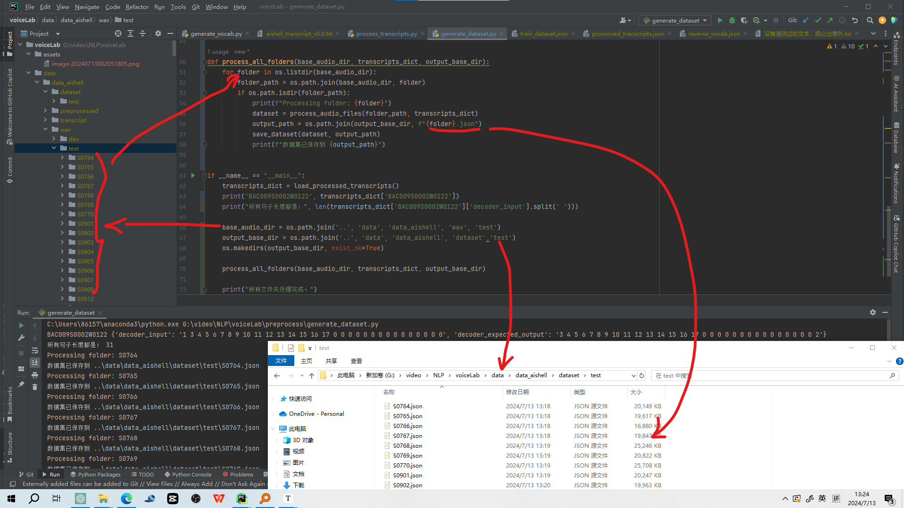

# voiceLab
语音识别和生成项目

#### 关键运行截图

### 参考论文汇总

#### 汉语不建议分词

[1905.05526 Is Word Segmentation Necessary for Deep Learning of Chinese Representations? (arxiv.org)](https://ar5iv.labs.arxiv.org/html/1905.05526)

#### 

