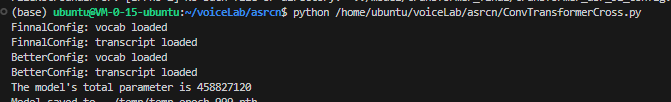

# voiceLab
语音识别和生成项目


#### 腾讯云-NVIDIA-A10

我的租用心得：选账号密码而不是ssh，不然很费时。流量按量付费，速度拉满。硬盘大一点，深度学习库留100G，数据集留100G


快速配置的必要指令[显示没有安装的安装一下即可]

```python
查看配置：
'''
free -h
nvidia-smi
lscpu
lsblk
glances
'''
下载数据集
'''
wget https://openslr.magicdatatech.com/resources/33/data_aishell.tgz
tar -xzvf data_aishell.tgz
'''
安装anaconda-pytorch环境,Anaconda3的安装包和pytorch版本未必最新可以去anaconda和pytorch官网查找最新版
'''
wget https://repo.anaconda.com/archive/Anaconda3-2023.03-Linux-x86_64.sh
bash Anaconda3-2023.03-Linux-x86_64.sh
source ~/.bashrc
conda create -n voicelab
conda activate voicelab
conda install pytorch torchvision torchaudio pytorch-cuda=12.1 -c pytorch -c nvidia
'''
远程连接
'''
vscode:remote develepment#插件，配置文件里写用户名和主机名，连接时输入密码即可
'''
安装额外的库
'''
conda install -c conda-forge librosa
pip install jiwer
pip install fast-ctcdecode
'''

```

#### 关键运行截图

###### 数据集预处理


##### transformer-crossentropy


初步测试


cer


##### conv-transformer训练的四阶段

模型大小有4.6亿参数



第一阶段：胡乱预测

第二阶段：全部预测为eos，这个时候很慌，但是不要害怕，我训练多次都是可以收敛的


第三阶段：损失减少且前面出现常见词，后面还是eos


阶段4

模型开始收敛，有意义的信息开始涌现，损失大幅下降


训练结束，交叉熵损失下降到0.02


##### transformer-ctc


#### 参考论文汇总

##### 汉语不建议分词

[1905.05526 Is Word Segmentation Necessary for Deep Learning of Chinese Representations? (arxiv.org)](https://ar5iv.labs.arxiv.org/html/1905.05526)


##### NEURAL MACHINE TRANSLATION

[[1409.0473\] Neural Machine Translation by Jointly Learning to Align and Translate (arxiv.org)](https://ar5iv.labs.arxiv.org/html/1409.0473)


##### transformer


